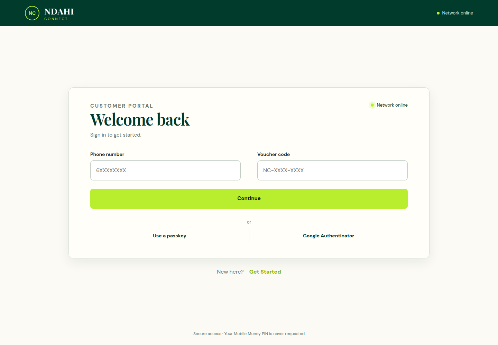
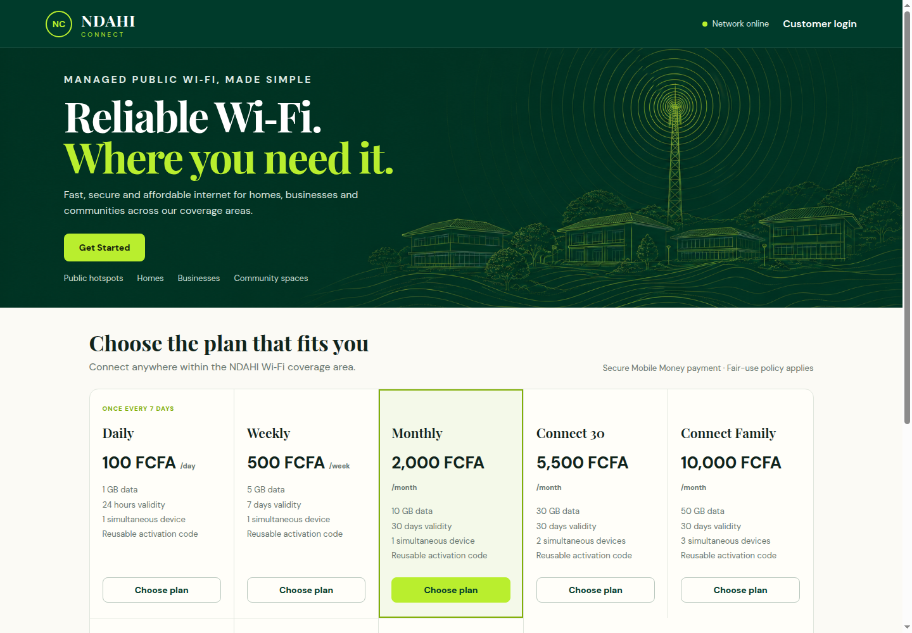
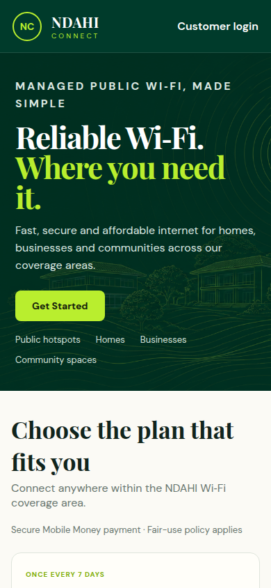
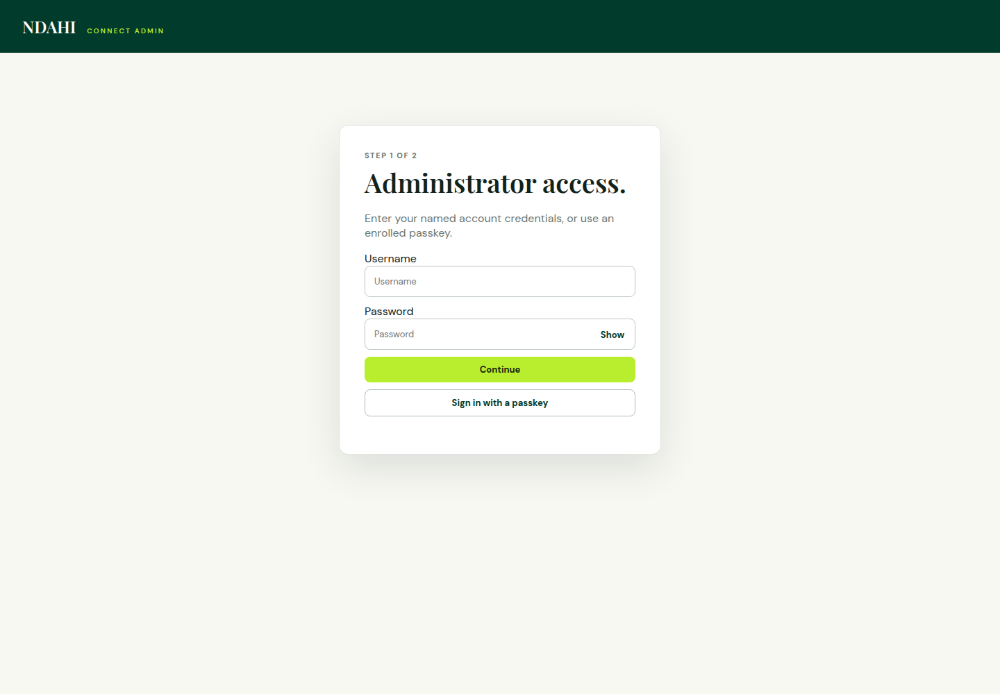

# Local versus live comparison — 2026-09-21

Local services are running at http://localhost:8080 (customer), http://localhost:8081 (admin), and http://localhost:8082 (API). The local API uses mock payment/email/network adapters and isolated data under `/tmp/ndahi-preview-data`; no production credentials or database were loaded. Preview process script: `/tmp/ndahi-preview.mjs`.

Live comparison targets: https://portal.ndahiconnect.net and https://admin.ndahiconnect.net. Fresh Chrome screenshots were captured and visually inspected at 1440×1000 and 390×844. The initial live desktop package capture was discarded while loading and replaced after all eight plans appeared.

## Findings and next work

1. **Customer login — visually consistent, status needs correction.** Both versions show the same voucher-first fields and alternative security methods. Both display “Network online” twice. The live API does not substantiate this network claim: its health response reports bootstrap mode, `operational: false`, and `networkProvisioning: false`. This is not evidence that the physical network is offline; it is evidence that the UI should distinguish configured, unknown, and confirmed service state. Prioritize **UX-004**.
2. **Desktop packages — visually consistent.** All eight plans match in name, price, quota, validity, and device limit. Local payments use `mock`; live payments use `mesomb`. Do not treat visual parity as proof of payment readiness. No live checkout was submitted.
3. **Mobile packages — readable at 390px, lengthy first screen.** Neither captured page has horizontal document overflow. The hero occupies most of the first viewport; only the start of the first package card is visible. Package comparison still needs keyboard, touch, high-zoom, and screen-reader checks before **UX-009** can be marked complete. Light muted copy and small badges warrant measured contrast/text-size checks; screenshots cannot establish WCAG compliance.
4. **Administrator login — visually consistent, authenticated comparison unavailable.** Both show named credentials and passkey sign-in. Production authentication was not attempted. Queue/reconciliation dashboards and real customer sessions require an authorized authenticated comparison separately.

## Runtime evidence

At approximately 13:22 UTC, both local and live `/api/health` endpoints returned HTTP 200. Live JSON reported `status: bootstrap`, `database: ready`, `operational: false`; payment, email, account, and administration capability flags were true, while network provisioning was false. These are configuration/readiness signals, not end-to-end payment or network tests. A successful live response may come from a previously deployed instance; it does not prove the previously timed-out deployment was accepted.

Both live frontend `/config.js` files reference `https://api.ndahiconnect.net`. Both `/api/plans` responses contain eight matching plans. The first live desktop visit was still loading after 3.5 seconds; it loaded on subsequent inspection. This is one observation, not a performance benchmark or a confirmed ongoing fault.

## Recommended sequence

- Implement **UX-004**: derive status from the API, with explicit setup/unavailable/unknown handling and appropriate refresh behavior.
- Then **UX-001–003**: prioritize account status, simplify activation for signed-in customers, and consolidate plan actions. Capture the authenticated dashboard before making these changes.
- Verify the deployed PAY/NET changes against staging/live integrations before marking production rollout complete. Current production configuration does not demonstrate network provisioning readiness.

## Captured steps

### 1. Customer login

Local:

Live:

### 2. Desktop packages

Local:

Live:

### 3. Mobile packages

Local:

Live:

### 4. Administrator login

Local:

Live:

## Limits

This is a public-screen comparison, not a full journey, accessibility, or security audit. No real purchases, refunds, account creation, device activation, or production admin mutations were performed. Authenticated screens, keyboard operation, screen readers, high zoom, and real network enforcement remain unverified.
